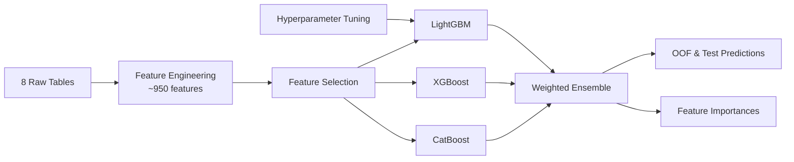

# Loan Default Prediction

End-to-end credit risk modelling pipeline engineering ~950 features from 8 relational datasets into a tuned LightGBM + XGBoost + CatBoost ensemble. Challenging due to significant class imbalance (~8% default rate) and sparse signal across multiple relational tables.

## Pipeline



## Results

| Model | OOF AUC | Held-out Test AUC | Weight |
|-------|---------|-------------------|--------|
| LightGBM | 0.78791 | — | 0.14 |
| XGBoost | 0.79102 | — | 0.42 |
| CatBoost | 0.79087 | — | 0.44 |
| **Ensemble** | **0.79348** | **0.78745** | — |

## Key Findings

- External data source scores (`EXT_SOURCE_1/2/3`) and their engineered interactions dominate predictive signal, accounting for 14.3% of cumulative ensemble importance
- XGBoost and CatBoost contribute near-equally (0.42/0.44); LightGBM adds marginal value (0.14) at default hyperparameters
- The strongest non-EXT_SOURCE predictors are `PAYMENT_RATE`, `PREV_INTEREST_RATE_max`, and `DAYS_EMPLOYED`
- 8.9% of initially engineered features had zero importance across all three models; the majority are NaN indicators and rare one-hot encoded categories

## Repository Structure

```
train.py                    # Entry point: feature engineering, training, weight tuning, predictions
tune.py                     # LightGBM hyperparameter tuning with Optuna
src/
  config.py                 # Paths, constants, model parameters
  features/
    pipeline.py             # Orchestrates feature engineering
    application.py          # Main application table features
    bureau.py               # Credit bureau features
    previous_application.py # Previous Home Credit application features
    pos_cash.py             # POS cash balance features
    installments.py         # Instalment payment features
    credit_card.py          # Credit card balance features
  models/
    lgbm_model.py           # LightGBM training
    xgb_model.py            # XGBoost training
    catboost_model.py       # CatBoost training
  utils/
    helpers.py              # Logging, memory reduction, timing
params/
  lgbm_best_params.json     # Best LightGBM hyperparameters from tune.py (loaded automatically by train.py)
  selected_features.json    # Features selected by cumulative importance threshold (loaded automatically by train.py)
```

## Design Decisions

- **Ensemble over single model** — blending LightGBM, XGBoost and CatBoost outperforms any individual model in all runs
- **Stratified K-Fold** — preserves the ~8% default rate in each fold, ensuring each fold is representative of the full dataset
- **Cumulative importance feature selection** — retains features accounting for 99% of ensemble feature importance, automatically dropping zero- and near-zero-importance features on subsequent runs
- **Separate tuning script** — `tune.py` tunes LightGBM hyperparameters on a row sample via Optuna TPE search; best params are saved to `params/` and loaded automatically by `train.py`

## Data

Download the data from [here](https://www.kaggle.com/competitions/home-credit-default-risk/data) and place the following files in `data/` in the project root:

```
data/
  application_train.csv
  application_test.csv
  bureau.csv
  bureau_balance.csv
  POS_CASH_balance.csv
  credit_card_balance.csv
  previous_application.csv
  installments_payments.csv
```

## Requirements

Python 3.13. Dependencies listed in `requirements.txt`.

## Setup

```powershell
python -m venv venv
.\venv\Scripts\Activate.ps1
pip install -r requirements.txt
```

## Future Work

- Hyperparameter tuning for XGBoost and CatBoost (currently only LightGBM is tuned)
- Feature interactions between EXT_SOURCE scores and credit/income ratios

## Run

```powershell
python train.py
```

Optionally tune LightGBM hyperparameters before training:

```powershell
python tune.py --trials 50 --folds 3
```

Tuned params are already committed to `params/lgbm_best_params.json` and loaded automatically by `train.py`. Run `tune.py` again with a narrower search space to refine further.
